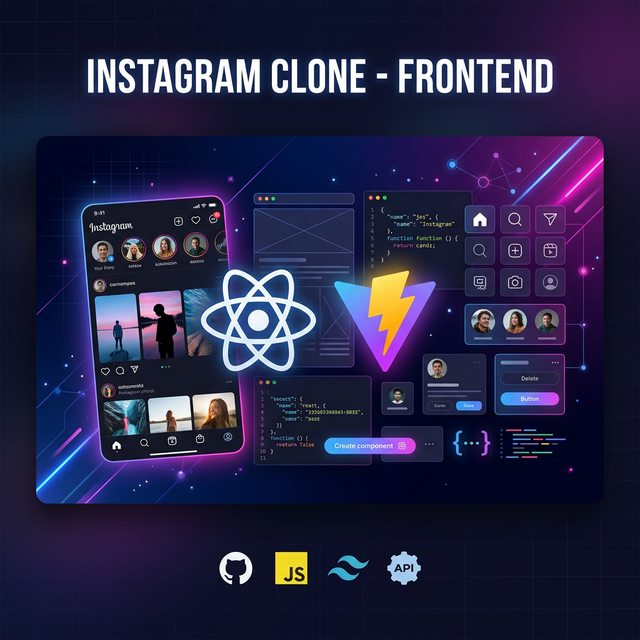

# 🎨 Instagram Clone - Frontend Development



Welcome to the **Frontend** development of the Instagram Clone! This phase focuses on building a responsive, modern UI using **React** and **Vite**, implementing client-side routing, and integrating with our backend API.

---

## 🚀 Key Features

### 🔐 1. Authentication UI
- **Registration Page** — User-friendly form for creating new accounts.
- **Login Page** — Secure login interface supporting username/email authentication.
- **Form Validation** — Real-time feedback using React state.

### 📱 2. Core Social Features
- **Responsive Navigation** — Bottom navigation for mobile and sidebar for desktop.
- **Post Feed** — Dynamic rendering of posts with images and captions.
- **User Profiles** — Displaying user details and post grids.

### ⚙️ 3. Backend Integration
- **Axios Networking** — Centralized API calls with custom configuration.
- **Session Management** — Handling JWT tokens securely via cookies (`withCredentials`).

---

## 🛠️ Tech Stack

| Tool / Library | Purpose |
| :--- | :--- |
| **Vite** | Lightning-fast build tool and dev server |
| **React** | Component-based UI library |
| **React Router** | Client-side routing for SPAs |
| **Sass (SCSS)** | Advanced CSS preprocessor for better styling |
| **Axios** | Promise-based HTTP client for API requests |
| **Lucide React** | Beautifully simple icon library |

---

## 🏗️ Project Structure

```text
instagram/
├── src/
│   ├── features/
│   │   ├── auth/          # Login, Register, & Auth logic
│   │   │   └── pages/     # Login.jsx, Register.jsx
│   │   └── post/          # Feed, Create Post, & Post details
│   ├── AppRoutes.jsx      # Route definitions
│   ├── App.jsx            # Main app container
│   ├── main.jsx           # Entry point
│   └── style.scss         # Global styles & variables
├── public/                # Static assets
└── vite.config.js         # Vite configuration
```

---

## 📡 Navigation & Routes

| Path | Component | Description |
| :--- | :--- | :--- |
| `/login` | `Login.jsx` | User authentication form |
| `/register` | `Register.jsx` | New user signup form |
| `/` | `Home.jsx` | Main social feed (Protected) |
| `/profile` | `Profile.jsx` | User profile page (Protected) |

---

## 📝 Lecture Notes & Concepts

### 🛤️ 1. React Router Dom Setup
To handle different pages without refreshing the browser, we use `react-router-dom`.

**Installation:**
```bash
npm i react-router-dom
```

**Implementation Tip:**
Ensure you wrap your app or define your routes in a dedicated file like `AppRoutes.jsx` to keep `App.jsx` clean.

---

### ⚡ 2. Development Shortcuts
Speed up your development with ES7+ shortcuts:
- `rafce`: **R**eact **A**rrow **F**unction **C**omponent **E**xport. Generates the standard boilerplate for a functional component.

---

### 🎨 3. Styling with Sass (SCSS)
We avoid using "Live SCSS Compiler" extensions in VS Code when working with React. Instead, we use the official package to let Vite handle the compilation automatically.

**Installation:**
```bash
npm i sass
```
**Why?** This ensures styles are scoped, supports variables/mixins, and integrates perfectly with the React build pipeline.

---

### 🔄 4. Two-Way Data Binding
In React, forms are "controlled" using state. This is known as two-way binding:
1. The **value** of the input is driven by state.
2. The **onChange** event updates the state.

```jsx
const [value, setValue] = useState("");

<form onSubmit={handleSubmit}>
    <input 
        type="text" 
        value={value} 
        onChange={(e) => setValue(e.target.value)} 
    />
</form>
```

---

### 🌐 5. API Requests with Axios
Axios is preferred over `fetch` for its simplicity and built-in features.

**Installation:**
```bash
npm i axios
```

**⚠️ The Cookie Problem:**
By default, Axios does not send or receive cookies (JWT tokens) from the backend. To fix this, we must enable the `withCredentials` flag:

```js
import axios from 'axios';

const api = axios.create({
    baseURL: 'http://localhost:3000/api',
    withCredentials: true // 👈 Crucial for Session/JWT handling
});
```

---

> [!TIP]
> Always use a dedicated `features` folder to organize your code by domain (Auth, Post, Profile) rather than by type (Components, Pages). This makes the project much easier to scale.

> [!IMPORTANT]
> When setting up Axios, create a central instance (e.g., `api.js`) so you don't have to repeat the `baseURL` and `withCredentials` settings in every component.

---

Made with ❤️ by Prince Chouhan