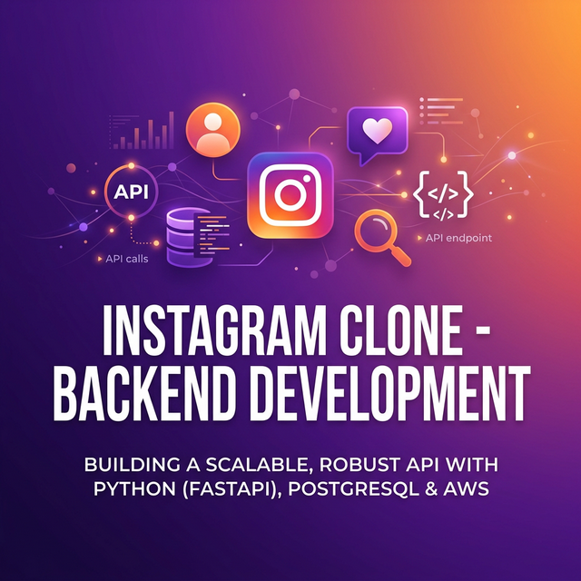

# 📸 Instagram Clone - Backend Development



Welcome to **Day 13** of the Backend Cohort! Today, we completed the second half of the Instagram Clone lecture, focusing on refactoring our code into a professional architecture using Controllers and finalizing the core infrastructure.

---

## 🚀 Key Features

### 🔐 1. Authentication System

- **User Registration**:
  - Securely saves user data to the database.
  - Generates and returns an authentication token upon successful registration.
  - **[Planned] OTP Based Registration**: Enhancing security via email/SMS verification.
- **Login**: Traditional credential-based login system.
- **Logout**: Implements secure sign-out logic.
  - **Token Blacklisting**: Ensures that once a user logs out, their previous token cannot be reused for unauthorized access.

### 🖼️ 2. Post Management

- **Create Posts**: Users can upload content (images/videos) with captions.
- **Social Feed**: A dynamic timeline showing posts from followed users.
- **Interactions**:
  - **Like Posts**: Implemented using optimized collection types for performance.
  - **Save Posts**: Allow users to bookmark their favorite content.

### 👥 3. User Relationships

- **Follow/Unfollow System**: Build a network of users.
- **Followers & Following**: Track user growth and social reach.

---

## ☁️ Media Storage

For profile pictures and post media, we are utilizing **[ImageKit.io](https://imagekit.io)**.

- **Benefits**: Real-time image optimization, resizing, and fast delivery via CDN.
- **Integration**: Seamlessly handles cloud uploads and returns manageable URLs for the database.

---

## 🛠️ Tech Stack

- **Node.js & Express**: Core backend framework.
- **MongoDB & Mongoose**: NoSQL database for flexible user and post schemas.
- **Crypto / MD5**: For initial password hashing experiments.
- **ImageKit**: Cloud-native image management.

---

## 📝 Lecture Notes Summary

- **Architecture (MVC)**: Transitioned to using **Controllers** to separate business logic from route definitions. This ensures that route files remain clean and only handle URIs and methods.
- **Efficiency**: Using `$or` operators in Mongoose for single-query existence checks (checking both email and username simultaneously).
- **Security**: Moving towards JWT-based authentication with proper blacklisting on logout.
- **Schema Design**: Default profile images are hosted on ImageKit to ensure a consistent UI from day one.

---

## 🏗️ Architectural Pattern: Controllers

In today's lecture, we learned the importance of **Separation of Concerns**. Instead of writing all the logic inside the route files, we moved it to a dedicated `controllers` folder.

- **Route Files**: Define the paths (e.g., `/register`, `/login`) and the HTTP methods (GET, POST).
- **Controller Files**: Contain the actual logic—talking to the database, hashing passwords, and generating tokens.

**Benefits:**

- **Cleaner Code**: Route files are much easier to read.
- **Scalability**: As we add more features (Likes, Comments, Posts), the project stays organized.
- **Reusability**: Logic can be decoupled and used in multiple places if needed.

---

## 🗺️ Project Structure

```text
src/
├── controllers/ # Business logic (Register, Login, etc.)
├── models/      # Database schemas (User, Post)
├── routes/      # API endpoints (Auth, Post)
├── config/      # Database & Service configurations
└── app.js       # Express application setup
```

---

> [!TIP]
> Always check for user existence using an optimized query to avoid redundant database calls. This improves API response times significantly.

---

Made with ❤️ by Prince Chouhan
